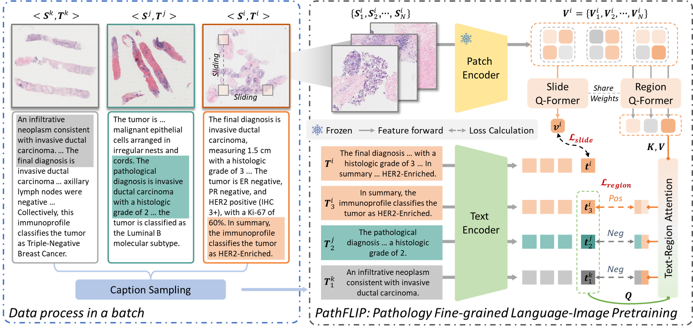
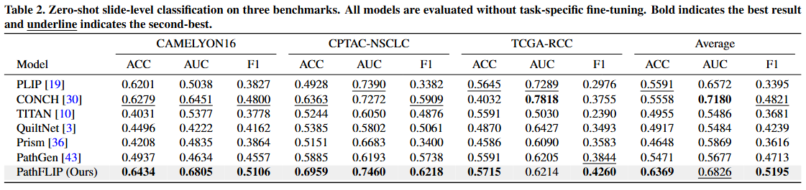
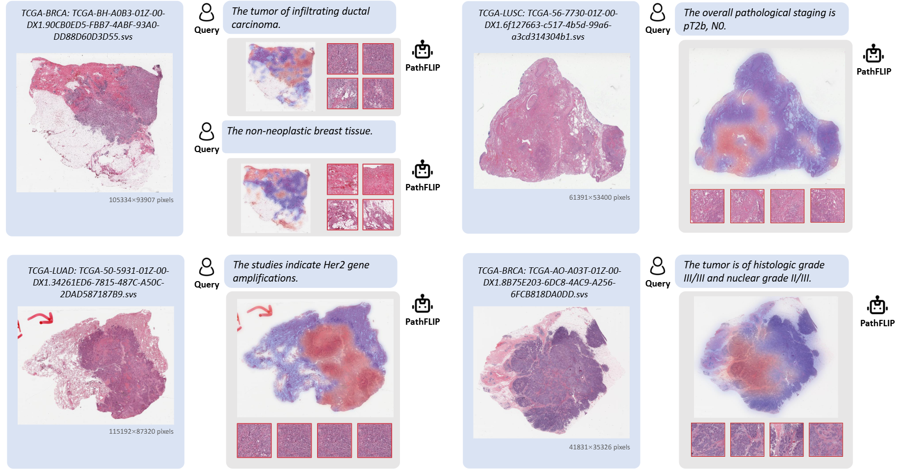

# PathFLIP

PathFLIP is a pathology vision-language learning project for whole-slide image representation learning, image-text alignment, retrieval, classification, and VLM fine-tuning.

## Framework

PathFLIP framework overview for WSI representation learning, image-text alignment, retrieval, and downstream VLM tuning.

## Repository Layout

```text
src/
  dataset/        Dataset and datamodule definitions
  model/          PathFLIP, PathFLIP-VLM, losses modules
  tools/          Training entry points and argument parsers
  eval/           Retrieval, classification, and VQA evaluation
scripts/          Reproducible shell entry points
datasets/         Lightweight split files and data instructions
```

## Setup

Create an environment with Python 3.10 or newer, then install dependencies:

```bash
pip install -r requirements.txt
```

Install the correct PyTorch build for your CUDA version if the default `pip` build is not appropriate for your machine.

## Data

Large JSON training files, WSI feature files, slides, checkpoints, and generated processing outputs are not tracked in Git. Put required dataset files under `datasets/`, or pass paths explicitly:

```bash
python -m src.tools.train_align \
  --train_data_path datasets/SlideInstruct_train_stage1_caption_fine_grained.json \
  --val_data_path datasets/SlideBench-Caption-TCGA-plus.json
```

See `datasets/README.md` for expected filenames.

## Training

Alignment training:

```bash
bash scripts/train_align.sh
```

VLM stage 1:

```bash
ALIGN_MODEL_CKPT_PATH=outputs/pathflip/checkpoint/pytorch_model.bin \
bash scripts/train_vlm_stage1.sh
```

VLM stage 2:

```bash
ALIGN_MODEL_CKPT_PATH=outputs/pathflip/checkpoint/pytorch_model.bin \
STAGE1_CKPT_PATH=outputs/pathflip_vlm_stage1/checkpoint/stage1_projector.bin \
bash scripts/train_vlm_stage2.sh
```

All scripts use environment variables for local paths so machine-specific paths do not need to be committed.

## Evaluation
For a quick test, you can download our weights at [https://huggingface.co/jshhhh/PathFLIP](https://huggingface.co/jshhhh/PathFLIP). We will continue to maintain the project!

Zero-shot classification:

```bash
ARGS_PATH=outputs/pathflip/lightning_logs/version_0/hparams.yaml \
CKPT_PATH=outputs/pathflip/checkpoint/pytorch_model.bin \
bash scripts/eval_zero_shot_cls.sh
```

Few-shot and retrieval scripts are available in `scripts/` and can be configured with `ARGS_PATH`, `CKPT_PATH`, `DATASETS`, and related environment variables.

## Results Display


WSI-level zero-shot classification comparison. PathFLIP shows consistent gains over representative baselines on benchmark settings.


Visual grounding examples. The model focuses on pathology-relevant regions aligned with text semantics.


## Citation
If our work is useful for your project, please cite:
```
@inproceedings{liu2026pathflip,
  title={Pathflip: Fine-grained language-image pretraining for versatile computational pathology},
  author={Liu, Fengchun and Jiang, Songhan and Cai, Linghan and Wang, Ziyue and Zhang, Yongbing},
  booktitle={Proceedings of the AAAI Conference on Artificial Intelligence},
  volume={40},
  number={9},
  pages={7132--7140},
  year={2026}
}
```
